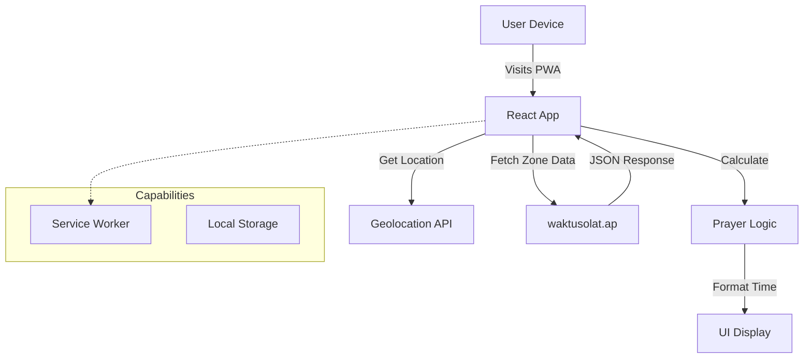

# 9M2PJU Iftar Time 🌙


**MODERN COMPANION DURING RAMADHAN**

A beautiful, high-performance Progressive Web App (PWA) designed to provide accurate prayer times and Iftar countdowns with a premium dark Islamic aesthetic. Built for speed, reliability, and offline usage.

## 🚀 Features

- **Dynamic Iftar Countdown**: Large, easy-to-read countdown timer to Maghrib.
- **Smart Geolocation**: Automatically detects your zone and fetches official JAKIM data via `waktusolat.app`.
- **Prayer Grid**: Clean visualization of all 5 daily prayers + Syuruk.
- **Hijri Date**: Displays the current Islamic date (e.g., *21 Sha'ban 1447*).
- **Offline PWA**: Installable on iOS/Android, works without internet after first load.
- **Perfect Fit Layout**: Optimized for desktop and mobile screens (no scrollbar on standard views).

## 🛠️ Tech Stack

- **Framework**: React 18 + TypeScript + Vite
- **Styling**: Tailwind CSS (v4) + Lucide Icons
- **State Management**: React Hooks (Custom `useSolat`, `useGeoLocation`)
- **Date Handling**: `date-fns`

## 🏗️ Architecture



## 📦 Installation

To run this project locally:

1.  **Clone the repository:**
    ```bash
    git clone https://github.com/9M2PJU/9M2PJU-Iftar-Time.git
    cd 9M2PJU-Iftar-Time
    ```

2.  **Install dependencies:**
    ```bash
    npm install
    # or
    yarn install
    ```

3.  **Start the development server:**
    ```bash
    npm run dev
    ```

4.  **Build for production:**
    ```bash
    npm run build
    ```

## 🤝 Contributing

Contributions are welcome! Please open an issue or submit a pull request for any improvements.

---

<p align="center">
  Made with ❤️ by <a href="https://hamradio.my">9M2PJU</a>
</p>
