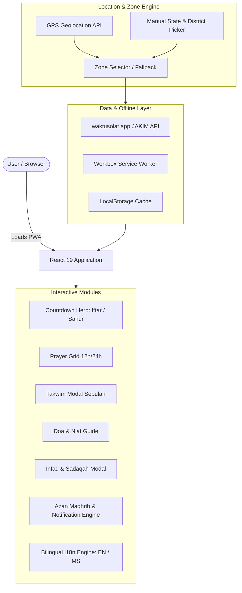

# 9M2PJU Iftar Time 🌙


**MODERN COMPANION DURING RAMADHAN**

A beautiful, high-performance Progressive Web App (PWA) designed to provide accurate prayer times, dynamic Iftar countdowns, Sahur/Imsak tracking, and authentic **Azan Maghrib** audio with a premium dark Islamic aesthetic. Built for speed, reliability, and 100% offline capability based on official JAKIM data via `waktusolat.app`.

---

## 🚀 Key Features

- **Redesigned Official Logo & App Identity**:
  - Redesigned vector emblem featuring an Emerald-Cyan crescent (*Hilal*), modern mosque dome & minaret silhouette, and a radiant 8-point gold sparkle star (*Najm*).
  - High-resolution multi-size PWA icons (`512x512`, `192x192`, `180x180` Apple touch icon, and multi-resolution `favicon.ico`).
- **Authentic Azan Maghrib Audio Playback**:
  - Automatically plays authentic **Azan Maghrib** when countdown reaches Iftar time (`00:00:00`).
  - Active audio wave visualizer with dedicated **"Stop Azan"** controls.
  - Interactive **"Test Azan"** button to preview playback anytime.
- **Bilingual Interface (English Default & Bahasa Melayu)**:
  - English interface by default, easily switchable to standard Bahasa Melayu via the navbar toggle with instant `localStorage` persistence.
- **Dynamic Dual-Mode Countdown**:
  - **Daytime Mode (Fajr → Maghrib)**: Real-time countdown to Iftar with an animated runner emoji (`🏃` ➔ `🍱`).
  - **Iftar Celebration (Maghrib window)**: Celebratory banner (*"Selamat Berbuka Puasa! / Iftar Mubarak"*) with festive glow.
  - **Nighttime Mode (Maghrib → Imsak/Fajr)**: Countdown to Imsak & Sahur (Tomorrow) with night progress tracking (`🌙` ➔ `🥣`).
- **Smart Geolocation & Manual Zone Selector**:
  - Auto-detects your Malaysian prayer zone via GPS coordinates.
  - Searchable **Manual Zone Selector** categorized by State (*Negeri*) and District (*Daerah*) covering all JAKIM zones across Malaysia.
- **Takwim Ramadhan (Jadual Waktu Solat Sebulan)**:
  - Interactive monthly prayer times table highlighting today's schedule and all 5 daily prayers + Imsak, Syuruk, and Maghrib (Iftar).
- **Panduan Doa & Niat Ramadhan**:
  - Dedicated reference modal for *Niat Puasa Ramadhan* (Daily & Full Month) and *Doa Berbuka Puasa* with Arabic calligraphy, Rumi transliteration, English/Malay translation, and one-click copy.
- **100% Offline PWA & Zero-Latency Cache**:
  - Service Worker (Workbox) with `StaleWhileRevalidate` runtime caching and `localStorage` fallback ensures instant access even without internet connectivity.
- **12-Hour / 24-Hour Time Format Switcher**:
  - User-configurable time format with persistent settings.
- **Support & Infaq (Sadaqah Modal)**:
  - Direct DuitNow QR integration to support server hosting and continuous development.

---

## 🛠️ Tech Stack

- **Framework**: React 19 + TypeScript + Vite
- **Styling**: Tailwind CSS (v4) + Framer Motion + Lucide Icons
- **State & Caching**: Custom React Hooks (`useSolat`, `useGeoLocation`), `localStorage`, Service Worker Workbox
- **Date Utilities**: `date-fns`
- **Testing**: Vitest + `@testing-library/react`
- **Audio Engine**: HTML5 Audio (Azan Maghrib) + Web Audio API Synthesizer

---

## 🏗️ Architecture


```mermaid
flowchart TD
    User([User / Browser]) -->|Loads PWA| App[React 19 Application]
    
    subgraph Location_Zone ["Location & Zone Engine"]
        Geo[GPS Geolocation API] --> ZoneMgr[Zone Selector / Fallback]
        Manual[Manual State & District Picker] --> ZoneMgr
    end

    subgraph Data_Layer ["Data & Offline Layer"]
        API[waktusolat.app JAKIM API]
        SW[Workbox Service Worker]
        Storage[LocalStorage Cache]
    end

    subgraph UI_Modules ["Interactive Modules"]
        Hero[Countdown Hero: Iftar / Sahur]
        Grid[Prayer Grid 12h/24h]
        Takwim[Takwim Modal Sebulan]
        Doa[Doa & Niat Guide]
        About[Infaq & Sadaqah Modal]
        Audio[Azan Maghrib & Notification Engine]
        Lang[Bilingual i18n Engine: EN / MS]
    end

    ZoneMgr --> Data_Layer
    Data_Layer --> App
    App --> UI_Modules
```

---

## 📦 Installation & Local Development

1. **Clone the repository:**
   ```bash
   git clone https://github.com/9M2PJU/9M2PJU-Iftar-Time.git
   cd 9M2PJU-Iftar-Time
   ```

2. **Install dependencies:**
   ```bash
   npm install
   ```

3. **Start development server:**
   ```bash
   npm run dev
   ```

4. **Run unit tests:**
   ```bash
   npm test
   ```

5. **Run linter:**
   ```bash
   npm run lint
   ```

6. **Build for production:**
   ```bash
   npm run build
   ```

---

## 🌐 Deployment

The application is deployed automatically to GitHub Pages via GitHub Actions on every push to `main`. Custom domain: `iftar.hamradio.my`.

---

## 🤝 Contributing

Contributions, bug reports, and suggestions are welcome! Please open an issue or pull request.

---

<p align="center">
  Made with ❤️ for the Ummah by <a href="https://hamradio.my">9M2PJU</a>
</p>
